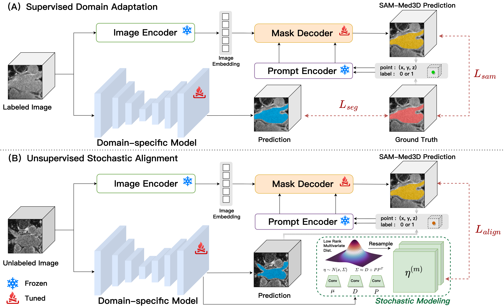

#  UP-SAM: Uncertainty-Informed Adaptation of Segment Anything Model for Semi-Supervised Medical Image Segmentation

[](https://ieeexplore.ieee.org/abstract/document/10822398)

Pytorch implementation of our method for BIBM 2024 paper: " UP-SAM: Uncertainty-Informed Adaptation of Segment Anything Model for Semi-Supervised Medical Image Segmentation".

## Contents

- [Abstract](##Abstract)
- [Installation](##Installation)
- [Datasets](##Datasets)
- [Usage](##Usage)
- [Repository Structure](##Repository Structure)
- [Citation](##Citation)
- [Acknowledgment](##Acknowledgment)

## Abstract


<p align="center">
  <a href="./fig/UP-SAM.pdf">
    
  </a>
</p>

<p align="center">
  <em>Overview of UP-SAM. Click the figure to open the vector PDF.</em>
</p>

Semi-supervised segmentation is extensively employed in medical image analysis due to its ability to leverage a small amount of labeled data alongside abundant unlabeled data. However, its performance is hindered by the inadequate knowledge of the data domain learned from limited labeled data and the absence of effective strategies for exploiting unlabeled regions, especially when annotations are extremely scarce. To address these challenges, the Segment Anything Model (SAM) has emerged as a promising solution. As a foundation model enriched by extensive and diverse domain knowledge, SAM has been leveraged to mitigate the epistemic uncertainty (EU) of semi-supervised segmentation models, while aleatoric uncertainty (AU) is often ignored. In this paper, we propose a novel semi-supervised medical image segmentation framework called UP-SAM, which adapts SAM for dual uncertainty assessments. The framework achieves effective collaboration between large foundation models and domain-specific models, leading to a simultaneous reduction in the impact of EU and AU. The experiments on the left atrium and pancreas datasets demonstrate the superior efficacy of UP-SAM against baseline methods. Particularly, UP-SAM exhibits substantial advantages over other semi-supervised learning models when dealing with exceedingly scarce labeled data. 

## Installation

Download the
[SAM-Med3D-turbo checkpoint](https://github.com/uni-medical/SAM-Med3D#checkpoint).
Pass its local path to `train_test.sh` as the final argument.

## Datasets

The experiments use:

- [2018 Atrial Segmentation Challenge](https://www.cardiacatlas.org/atriaseg2018-challenge/)
- [NIH Pancreas-CT](https://www.cancerimagingarchive.net/collection/pancreas-ct/)

Preprocess each scan as an HDF5 file containing two arrays named `image` and
`label`. The first `LABEL_NUM` entries in `train.txt` are treated as labeled
samples, and the remaining entries are treated as unlabeled samples.

## Usage

All commands are provided in `train_test.sh`. Run the script from the
repository root:

```bash
bash train_test.sh \
  METHOD \
  DATA_DIR \
  SAVE_PATH \
  DATASET \
  LABEL_NUM \
  BATCH_SIZE \
  GPU \
  SAM_CHECKPOINT
```

| Argument | Description |
| :--- | :--- |
| `METHOD` | Experiment name, for example `UPSAM` |
| `DATA_DIR` | Root of the preprocessed LA or Pancreas-CT dataset |
| `SAVE_PATH` | Directory for checkpoints, logs, and predictions |
| `DATASET` | `LA` or `Pancreas` |
| `LABEL_NUM` | Number of labeled training volumes |
| `BATCH_SIZE` | Total batch size; half of each stage-2 batch is labeled |
| `GPU` | CUDA device index, for example `0` |
| `SAM_CHECKPOINT` | Path to `sam_med3d_turbo.pth` |

### Examples

Left Atrium with two labeled volumes:

```bash
bash train_test.sh \
  UPSAM \
  /path/to/LA_dataset \
  ./results \
  LA \
  2 \
  4 \
  0 \
  /path/to/sam_med3d_turbo.pth
```

Pancreas-CT with two labeled volumes:

```bash
bash train_test.sh \
  UPSAM \
  /path/to/Pancreas-processed \
  ./results \
  Pancreas \
  2 \
  4 \
  0 \
  /path/to/sam_med3d_turbo.pth
```

> [!NOTE]
> For the one-labeled-volume setting, use a total batch size of `2`.

The script runs the complete pipeline:

1. VNet pre-training for 7,500 iterations using SGD with a learning rate of
   `1e-2`.
2. UP-SAM semi-supervised training for 7,500 iterations using AdamW with a
   learning rate of `1e-5`.
3. Sliding-window inference using the best domain-specific checkpoint.

## Repository Structure

```text
.
├── dataloaders/       # LA and Pancreas-CT dataset readers
├── networks/          # VNet and four-head VNet
├── SAM_Med3D/         # SAM-Med3D model and prompting components
├── utils/             # Losses, stochastic alignment, and evaluation
├── train.py           # Stage-1 and stage-2 training
├── test.py            # Sliding-window inference
└── train_test.sh      # End-to-end training and inference
```

## Citation

If you find this repository useful, please cite:

```bibtex
@inproceedings{lu2024upsam,
  title     = {UP-SAM: Uncertainty-Informed Adaptation of Segment Anything Model
               for Semi-Supervised Medical Image Segmentation},
  author    = {Lu, Wenjing and Hong, Yi and Yang, Yang},
  booktitle = {2024 IEEE International Conference on Bioinformatics and
               Biomedicine (BIBM)},
  pages     = {2256--2261},
  year      = {2024},
  doi       = {10.1109/BIBM62325.2024.10822398},
  publisher = {{IEEE}}
}
```

## Acknowledgements

This implementation builds on
[SAM-Med3D](https://github.com/uni-medical/SAM-Med3D),
[UPCoL](https://github.com/VivienLu/UPCoL),
[FUSSNet](https://github.com/grant-jpg/FUSSNet), and
[SSL4MIS](https://github.com/HiLab-git/SSL4MIS). Please follow the licenses and
citation requirements of the corresponding projects.
